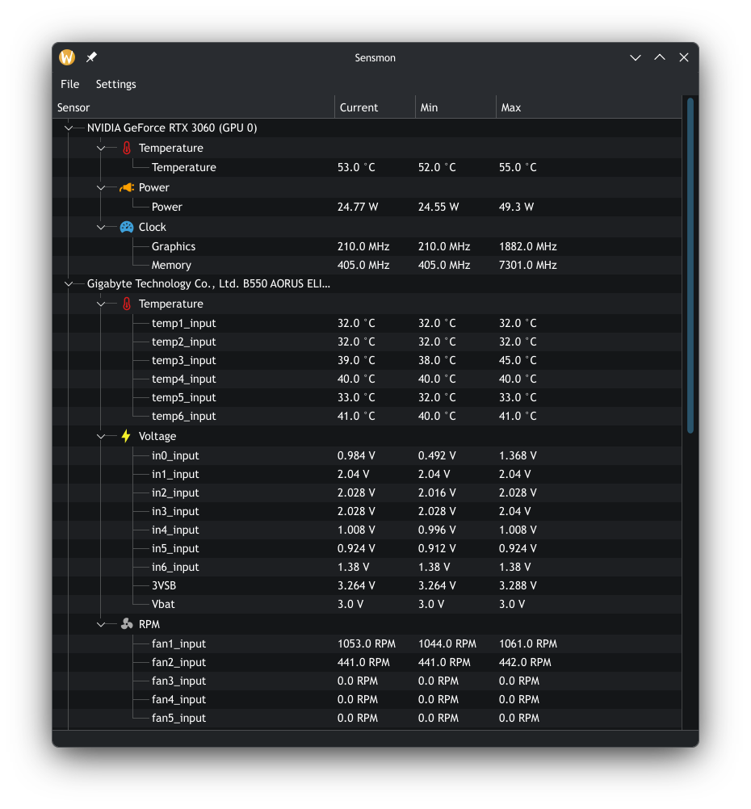

# Sensmon
A real-time hardware sensor monitoring application for Linux.

 

## Description
Sensmon is a PyQt6-based application that uses the Linux `hwmon` interface to display hardware sensor data, including temperature, voltage, fan RPM, and power readings. It improves readability by mapping kernel-exposed sensor device names to their actual hardware device names, making the output easier to understand.

Support for NVIDIA GPUs is provided via `nvidia-smi`, allowing GPU-specific metrics to be integrated alongside standard system sensors.

## Getting Started
### Dependencies
- PyQt6
- `nvidia-smi` (optional, for NVIDIA GPU metrics)

<details>
  <summary>Arch Linux</summary>
  <br>

  ```
  sudo pacman -S python-pyqt6
  ```
</details>

<details>
  <summary>Debian-based</summary>
  <br>

  ```
  sudo apt install pyqt6-dev-tools libqt6svg6
  ```
</details>

<details>
  <summary>Fedora</summary>
  <br>

  ```
  sudo dnf install python3-pyqt6
  ```
</details>

### Installing
```
git clone https://github.com/hamidshxrifi/sensmon.git
cd sensmon
```
### Executing Program
Make the script executable and run:
```bash
chmod +x sensmon
./sensmon
```
## License
This project is licensed under the MIT License - see the LICENSE.md file for details
